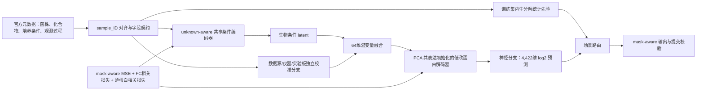
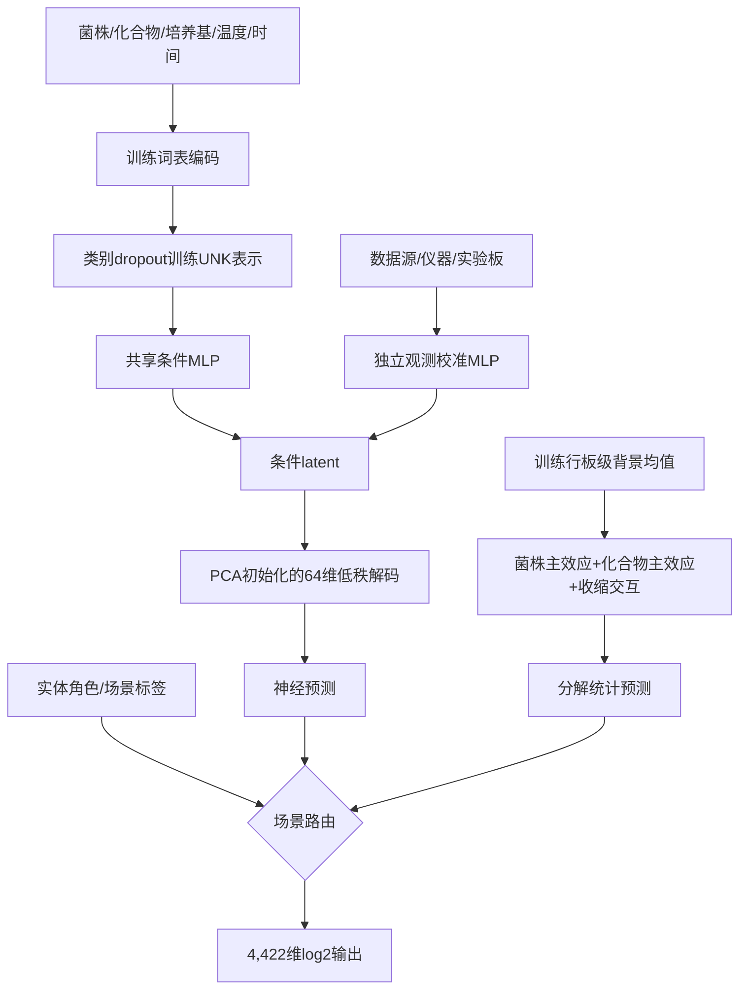

# 一、项目概述

## 1.1 项目名称

**CellShift：面向条件响应预测的酵母虚拟细胞**

## 1.2 参赛方向

我们参加世界人工智能开源大赛 GOAI“AI for Research 前沿探索”赛道三算法赛的虚拟细胞方向，研究任务是基于酵母扰动蛋白质组数据进行条件响应预测。我们选择**封闭数据榜**：模型训练、特征统计、验证选模和测试推理只使用组委会发布的数据与字段，不引入基因组、SMILES、GO、KEGG、STRING或闭源模型输出。这样做并不是回避生物学信息，而是为了让初赛结论能够被完整复现，并把性能变化明确归因于任务建模而非外部数据匹配质量。

## 1.3 方案概述

我们研究在不输入真实对照蛋白组的前提下，如何由菌株、化合物、培养条件和观测过程直接生成扰动后的 log2 蛋白向量。CellShift 由训练集内生统计先验与神经预测两条分支组成：新化合物和时间场景采用分解统计先验，新菌株和双重未知场景采用 unknown-aware 共享条件编码器；神经分支通过独立观测校准、PCA 初始化的低秩蛋白解码器和 mask-aware 多目标损失学习响应，最终由场景路由输出 4,422 维预测。我们以冻结的四类 OOD 划分、双基线和组件消融验证每项决策。

下图给出 CellShift 的最终架构。图中两条预测分支共享相同的数据边界，所有统计量均只由 `split_final=train` 的行计算，路由只读取官方元数据中的实体角色或场景标签，不读取验证或测试蛋白真值。

# 二、科学问题理解

## 2.1 科学问题与研究对象

我们的研究对象是酿酒酵母。它具有真核细胞的基本组织方式，同时培养周期短、实验成本低、扰动条件可控，适合系统采集跨菌株、跨化合物和跨环境的响应数据。相较只反映转录潜势的 RNA，蛋白质组更接近酶活性、代谢与细胞功能的执行层；酵母实验还没有人体或动物实验的伦理负担。因此，它既能承载真实的真核调控问题，又允许形成规模化、可复验的扰动数据。

核心科学问题是：**AI 能否在菌株或化合物未出现在训练集的情况下，仅根据条件元数据，预测扰动后的完整蛋白质组状态？** 任务输入由菌株、化合物、培养基、温度、处理时间以及数据源、仪器和实验板等观测信息组成，输出为扰动样本的 log2 蛋白强度向量。模型不接收与该样本配对的真实 control 蛋白向量；control 只由评测端用于计算 `Δ = y_treat - y_control`。因此，本任务不是“输入对照、预测差值”的普通回归，而是带有实体级零样本条件的 OOD 高维生成问题。

我们对官方文件进行了逐行审计，实际难度边界如下。教程中的部分示例字段和4,232维说明与当前数据包不一致，我们以组委会实际发布文件为特征契约：训练行缺失率达到80%的蛋白被删除后，当前数据保留4,422维。

| 难度维度 | 官方数据审计结果 | 对建模的约束 |
|---|---:|---|
| 条件空间 | 6个菌株；56个化合物/溶剂标签（不含 Quality Control）；2种培养基；2个温度；6个时间点 | 条件组合远多于完整观测组合，不能逐组合记忆 |
| 训练与验证总样本 | 8,958 | 高维目标下仍属于小样本 |
| 冻结训练样本 | 5,920 | 所有特征统计、PCA和模型参数只从这些行拟合 |
| 原始蛋白维度 | 5,243 | 每个样本含系统性缺失，不能把NA当作0表达 |
| 训练集80%缺失率过滤后 | 4,422，删除821个蛋白 | 输出契约必须与训练过滤结果逐列一致 |
| 新化合物验证 `val_chem_only` | 1,065 | 检验对未见化合物的回退能力 |
| 新菌株验证 `val_strain_only` | 1,547 | 其中1,333个为非control/非质控处理样本 |
| 双重未知验证 `val_both` | 269 | 菌株和化合物同时未见，是最严格的零样本场景 |
| 时间验证 `val_time` | 157 | 其中139个为处理样本，检验连续时间表示 |
| 测试元数据 | 4,454 | 干跑提交必须输出4,454×4,422矩阵 |

这些数字说明，真正瓶颈不是选择更深的回归网络，而是同时处理“小样本—高维输出—系统缺失—实体未知”四重约束。尤其在封闭数据榜中，未见菌株和化合物没有基因组或分子结构可用，模型不可能凭类别名称恢复实体特异机制；合理目标是学习可检验的共享响应、已见实体效应和稳定的未知实体回退，而不是让随机类别编码伪装成可迁移语义。

## 2.2 科学意义

**应用价值。** 湿实验不可能穷举所有菌株、化合物、培养条件和时间组合。若模型能够从已观测条件中恢复稳定的共享响应，并为未实验条件给出带有方向性的蛋白质组预测，研究者可以先筛除低信息组合，把有限实验资源集中到高效应或高不确定条件。我们把模型输出限定为可与质谱观测直接比较的 log2 蛋白强度，而不是只给出抽象类别，使预测可以通过差异蛋白、响应方向和后续重复实验检查。

**方法价值与可迁移性。** 本任务代表一类常见的 AI4Science 问题：实体组合稀疏、输出维度高、缺失非随机、技术批次和生物条件纠缠。CellShift 的方法价值不依赖酵母专有的手写规则，而来自五项可迁移设计：未知类别回退、训练集内生的分解统计先验、低秩相关输出、观测过程分支和与科学差值一致的损失。相同框架可以迁移到转录组扰动、药物反应、材料配方和多环境表型预测，只需替换实体字段和输出矩阵。

**与已有工作的边界。** 早期全细胞模型以人工编写反应方程和模块耦合为主，2012年前后的代表工作证明了整细胞计算模型的可能性，但扩展成本受制于知识覆盖和参数标定。2024年前后提出的 AI 虚拟细胞愿景把学习系统从单一预测器推进到可计算的细胞状态模型；第一届虚拟细胞挑战赛则主要考察小分子扰动后的转录组响应。当前赛题进一步把预测对象从转录组推进到更接近功能执行层的蛋白质组，并同时加入多菌株、多培养条件和实体正交划分。我们的推进点不是宣称构建了完整的机制细胞，而是在这一新边界上给出可运行证据：共享条件模型是否能恢复蛋白质组绝对状态，训练集内生先验是否能帮助未知实体场景，哪些提升来自观测校准，哪些仍受封闭数据的不可辨识性限制。

# 三、技术方案与预期方法路线

## 3.1 技术方案

**① 任务形式化。** 对第 (i) 个样本，我们记生物条件为 (b_i=(s_i,c_i,m_i,T_i,t_i))，其中 (s_i) 为菌株、(c_i) 为化合物、(m_i) 为培养基、(T_i) 为温度、(t_i) 为处理时间；记观测过程为 (o_i=(d_i,q_i,p_i))，分别表示数据源、仪器和实验板。模型直接估计

\[
\hat{y}_i=f_\theta(b_i,o_i)\in\mathbb{R}^{4422},
\]

其中每一维是一个保留蛋白的 log2 强度。训练时仅在真实观测位置 (M_{ij}=1) 计算梯度。评测端使用真实匹配对照构造 (\Delta_{true}=y_{treat}-y_{control}) 和 (\Delta_{pred}=\hat y_{treat}-y_{control})，但 (y_{control}) 不进入模型输入。

**② 我们的方案架构。** 我们最终选择五项相互兼容的设计：unknown-aware 共享条件编码器、独立观测校准分支、PCA共表达初始化的低秩解码器、mask-aware多目标损失、训练集分解统计先验与场景路由。我们没有采用教程中强调的神经残差分解网络，因为同随机种子和同评估口径下，它在无批次分支时的四场景平均RMSE为0.8217，略差于共享编码器的0.8200；加入相同校准分支后，两者分别为0.4412和0.4407。差异虽小，但没有证据支持用更复杂、组件更难辨识的结构替换共享编码器。

这一选择延续了 NeurIPS 2023 Open Problems – Single-Cell Perturbations 中“共享编码器承担高维多输出、交叉验证决定模型上限”的经验：我们让所有蛋白共享同一条件表示，再由相关输出解码器恢复蛋白谱。MoA Prediction 对 vehicle 对照和后处理校准的利用则提醒我们，观测过程与对照结构不能被当作普通类别混入生物编码。因此，CellShift 将数据源、仪器、实验板单独建模，并把训练集内生统计先验作为可审计分支，而不是把所有字段拼接进一个不可解释的大网络。

下图展开最终数据流。共享编码器与统计先验不是两个独立模型的随意集成：它们分别解决“未知实体稳健回退”和“已知主效应可解析利用”，路由依据官方场景角色作确定性选择。

**③ 特征工程。** 我们选择能在封闭数据内被严格复现的特征，不使用化合物名称的任意hash来伪造结构语义，也不使用训练行目标均值直接编码验证实体。特征体系如下。

| 特征体系 | 具体实现 | 解决的问题 |
|---|---|---|
| 生物类别编码 | 菌株、化合物、培养基、温度分别建立训练词表和可学习embedding | 学习已见实体与培养条件的共享表示 |
| unknown-aware回退 | 词表外实体映射到索引0；训练时随机把菌株、化合物和实验板替换为UNK | 让UNK向量在训练中获得梯度，避免新实体使用随机未训练向量 |
| 时间外推编码 | 由处理分钟数构造线性、二次、对数和基于训练时间中位数的衰减特征 | 保留15、30、60、90、120、240分钟的次序与连续性 |
| 观测过程特征 | 数据源、仪器、实验板只进入独立校准分支 | 隔离系统偏差，避免与生物条件embedding直接混合 |
| 板级共享背景 | 按数据源、仪器、实验板、培养基、温度、时间计算训练行蛋白均值 | 为所有场景提供仅由训练数据形成的上下文参照 |
| 实体分解先验 | 在板级背景上估计菌株残差、化合物残差及收缩后的已见组合残差 | 新化合物保留菌株效应，新菌株保留化合物效应，双未知退回共享背景 |

统计先验遵守一条不可妥协的纪律：均值、残差、PCA和词表都只由5,920条训练行计算。新实体没有训练统计量时不以验证集补齐，而是显式置零该实体效应并退回共享背景或训练过的UNK表示。场景路由中，新化合物和时间划分采用分解统计先验；新菌株和双重未知划分采用神经分支，因为实际验证显示后者在这两类场景的Δ PCC更高。

**④ 稳定性设计。** 我们把稳定性措施放在数据、模型和评估三层，而不是只依赖早停。

| 防护层 | 具体措施 | 防止的失败 |
|---|---|---|
| 数据层 | `sample_ID`唯一键对齐；只用训练行计算缺失率；保留原始mask；观测值严格为正后才做log2；测试真值文件在加载器中不可达 | 行错位、验证泄漏、NA伪装成低表达、尺度错误 |
| 模型层 | UNK类别dropout；64维低秩解码；PCA初始化；梯度裁剪；固定随机种子；组件正则 | 新实体随机输出、高维过拟合、相关性损失数值不稳定 |
| 评估层 | 四场景分别报告；均值与Matched Control双基线；同一早停规则；embedding置零压力测试；提交四项assert | 大样本场景掩盖失败、只看Global R²、自证式消融、无效文件提交 |

**⑤ 我们的创新设计。** 五项创新分别对应不同评测模块，组合关系是“共享编码形成条件latent—校准分支剥离观测偏移—低秩解码恢复相关蛋白输出—多目标损失对齐绝对与差异指标—统计路由处理不同OOD信息边界”，不存在残差网络与端到端网络重复争夺同一解释的矛盾。

| 创新点 | 主要对应评测模块 | 权重 | 核心消融 |
|---|---|---:|---|
| unknown-aware共享条件编码 | 药物均值残差；双重未知/时间外推 | 20%＋10% | 去掉类别dropout；菌株/化合物置零 |
| 独立观测校准分支 | 绝对保真度；上下文均值残差 | 20%＋20% | 移除整个分支；实验板置零 |
| PCA初始化低秩蛋白解码 | 绝对保真度；高效应蛋白与DEP | 20%＋5% | 保持网络不变，仅改为随机解码器初始化 |
| mask-aware多目标损失 | 原始FC；绝对保真度；两类残差 | 25%＋20%＋40% | MSE-only与多目标同架构对比 |
| 分解统计先验与场景路由 | 原始FC；两类残差；双重未知/时间 | 25%＋40%＋10% | 纯神经、纯统计与确定性路由三方对比 |

第一，现有类别模型在未见实体上通常把所有对象映射到同一个未训练索引，或者使用化合物名称hash制造没有物理意义的差异。我们选择训练期类别dropout而非hash，因为封闭数据中没有证据表明字符串距离对应分子或菌株相似性。其正确性来自严格的训练词表，稳定性来自UNK索引在训练期被反复激活。去掉类别dropout后，平均RMSE由0.4410恶化到0.4606，新化合物RMSE由0.3939恶化到0.4459，双重未知由0.5039恶化到0.5392，证明提升确实来自未知实体回退而非参数增多。

第二，高维蛋白输出不是4,422个互不相关的标量。我们选择PCA共表达初始化的64维可训练解码器，而不是直接建立4,422个独立输出头，因为训练样本只有5,920条，独立输出会忽略蛋白共同变化并增加方差。PCA仅在训练行、均值填补后的残差矩阵上拟合，64个分量解释82.03%的训练方差；随后解码权重继续由mask-aware损失微调。把PCA初始化替换为相同维度的随机初始化后，平均RMSE从0.4410上升到0.4520，四场景Δ PCC均下降。因此它既是训练集内生的蛋白侧先验，又没有引入封闭榜之外的注释。

第三，质谱数据的观测过程会引入系统偏移，但实验板也与培养条件共同设计，不能简单宣称所有板差异都是技术噪声。我们的差异设计是让数据源、仪器和实验板只进入独立加性latent分支，并用类别dropout和置零压力测试限制捷径。加入该分支后，共享编码器平均RMSE从0.8200降至0.4407；将实验板统一置零后，四场景RMSE只恶化约0.009到0.014，并未退回0.82，说明提升不是由单一plate字段记忆全部答案。文档中我们把它表述为“观测—上下文校准”，不把相关性夸大为纯仪器因果效应。

第四，OpenVaccine等高维缺失输出比赛反复表明，loss决定模型学到什么。我们选择mask-aware MSE作为主损失，同时加入逐样本fold-change相关损失和逐蛋白相关损失，而不是只优化Global R²。实际配置的三项权重分别为1、0.2和0.05，并对化合物、交互和批次latent施加小幅正则。与MSE-only相比，多目标版本的平均RMSE由0.4407轻微变为0.4410，但平均Δ PCC由0.3728提高到0.3855；考虑65%的技术评分围绕Δ展开，我们保留这一可解释的权衡。

第五，纯神经网络在所有场景使用同一推理方式，没有利用“哪一类实体已见”的信息边界。我们的统计分支从训练行估计板级共享背景、菌株主效应、化合物主效应和收缩后的已见组合效应：新化合物场景使用共享背景与已见菌株效应，时间场景还可使用已见实体组合效应；新菌株和双重未知则交给训练过UNK回退的神经模型。纯神经、纯统计和路由的平均RMSE分别为0.4410、0.4373和0.4298，平均Δ PCC分别为0.3855、0.3727和0.3925。路由规则由实体角色决定，不按单个样本预测结果动态挑选，因此可复现并能直接迁移到测试集的 `test_chem_only/test_strain_only/test_both/test_time` 标签。

**⑥ 风险与缓解。** 我们只列出会改变最终结论的三项高影响风险，并为每项保留可运行回退。

| 风险 | 可能后果 | 缓解措施 | 失败回退 |
|---|---|---|---|
| 实验板与生物条件共线，校准分支学习捷径 | 内部验证高、换板后崩溃，科学解释错误 | 分支隔离、plate类别dropout、plate置零压力测试、分场景报告 | 去掉plate，仅保留数据源/仪器；或退回训练行分解统计先验 |
| 封闭数据没有新菌株/新化合物语义 | 双重未知无法形成实体特异预测 | 训练UNK回退；路由按已见信息决定可用主效应；不使用无语义hash | 双未知退回板级共享背景，报告不可辨识边界而不伪造机制 |
| 高维缺失导致解码器和相关损失不稳定 | 梯度NaN、少数高丰度蛋白主导、提交含非法值 | mask-aware计算、PCA低秩初始化、有限值断言、梯度裁剪、固定种子 | 关闭相关性辅助损失，回退PCA初始化的MSE-only模型 |

## 3.2 预期方法路线

我们的研发路线按“每一步都能独立验证、失败就退回上一稳定版本”推进。阶段不是对外提交的多个版本，而是构建同一最终方案的证据链。

| 阶段 | 做什么 | 验证标准与当前证据 | 失败回退 |
|---|---|---|---|
| 阶段0：数据与双基线 | 对齐8,958行元数据和蛋白矩阵；训练行80%缺失过滤；复现蛋白均值与Matched Control | 已确认5,243→4,422；四类冻结场景数量一致；均值基线与官方诊断趋势一致；测试真值不加载 | 对齐、过滤或尺度任一assert失败即停止，不进入训练 |
| 阶段1：条件编码 | 建立训练词表、连续时间特征和类别dropout；训练无校准低秩模型 | 共享模型在新化合物、新菌株、时间场景逐蛋白R²中位数转正；双重未知为-0.018，未完全通过 | 保留UNK机制，引入独立校准；若仍失败则退回分解统计先验 |
| 阶段2：架构与校准 | 对比共享编码器和神经残差分解；加入观测校准 | 共享架构优于残差分解；加入校准后双重未知逐蛋白R²中位数升至0.754，较无校准版本显著提升 | 若校准产生plate捷径，去掉plate或使用plate置零版本 |
| 阶段3：蛋白内生先验与多目标 | PCA共表达初始化；FC和逐蛋白相关损失；场景路由 | PCA消融有效；多目标使平均Δ PCC 0.3728→0.3855；路由进一步到0.3925，相对提升约5.3% | 相关损失不稳则回退MSE-only；路由失效则统一使用神经分支 |
| 阶段4：科学解释与复验 | 锁定预测后分析高效应蛋白、时间曲线和可复验条件；外部注释只用于赛后解释，不反馈封闭榜模型 | 通过门槛是差异蛋白方向稳定、同类条件响应一致，并形成可由湿实验复验的条件清单；不把通路富集P值写成模型性能 | 若外部注释映射不完整，只报告蛋白级效应与时间规律，不扩张机制结论 |

渐进式路线让架构选择由数据决定。残差分解没有胜出时，我们保留了更简单的共享编码器；多目标损失牺牲极少绝对RMSE但改善Δ指标时，我们根据官方权重保留；场景路由只有在三方对比后才进入最终方案。任一复杂模块失效都不会破坏数据流水线、低秩模型和统计先验三条稳定基线。

## 3.3 数据来源、依赖工具与运行流程

比赛文件和可选外部资源的边界如下。外部资源出现在表中是为了完整披露我们评估过的选择，不代表它们进入封闭榜模型。

| 数据 | 文件或来源 | 数量/字段 | 在本方案中的用途 |
|---|---|---:|---|
| 训练验证元数据 | `WAYB_WAYC_metadata_train_val(1).csv` | 8,958行，15列（含sample_ID） | 条件编码、冻结划分、场景角色 |
| 训练验证蛋白组 | `WAYB_WAYC_proteome_raw_train_val.csv` | 8,958行，5,243个原始蛋白列 | 训练目标；训练行过滤后4,422维 |
| 测试元数据 | `WAYB_WAYC_metadata_test(1).csv` | 4,454行，15列 | 只用于最终推理和输出行序 |
| 测试蛋白真值 | `WAYB_WAYC_proteome_raw_test.csv` | 4,454行，5,243个原始蛋白列 | 隔离；训练、验证、调参和提交检查均不读取 |
| 菌株基因组 | Peter et al. 2018，1,011株酿酒酵母基因组 | 1,011株 | 封闭榜不使用；开放知识扩展候选 |
| S288C参考基因组 | SGD | 单一参考基因组 | 封闭榜不使用，也不为DHY210建立代理 |
| 化合物结构 | PubChem/ChEMBL | 名称、CID、SMILES等 | 封闭榜不查询、不缓存、不编码 |
| 蛋白功能与互作 | GO/KEGG/STRING | 通路、功能、PPI | 不进入训练；模型锁定后可用于独立解释 |

| 工具 | 实际版本或约束 | 职责 |
|---|---|---|
| Python | 3.12.9 | 统一运行入口与脚本编排 |
| NumPy | 2.2.4 | mask、log2、PCA缓存和数值断言 |
| pandas | 2.2.2 | sample_ID对齐、分组统计先验、结果表 |
| scikit-learn | 1.6.1 | 训练集随机PCA初始化 |
| PyTorch | 2.5.1，CUDA 12.1构建 | 共享编码器、低秩解码器、多目标训练 |
| Git | 2.55.0 | 版本管理；`input/`与模型产物默认忽略 |
| 单元测试 | Python unittest | 验证mask指标和未知实体映射 |

| 合规事项 | 我们的披露 |
|---|---|
| 外部数据许可 | 主模型未使用任何外部数据，因此不存在外部许可传递到预测结果的问题 |
| 商业API/闭源模型 | 数据处理、特征生成、训练和推理均未调用DeepSeek、Qwen或其他商业API/闭源模型 |
| DHY210代理假设 | 未使用基因组特征，因此没有以S288C代理DHY210；若转开放知识榜，该假设必须单独披露并消融 |
| 测试真值边界 | 数据包虽含测试蛋白文件，但加载器结构上只解析 `*train_val*`；提交干跑只加载测试元数据 |
| 开源范围 | 开源数据加载、过滤、模型、损失、评估、压力测试、配置和复现命令；不重新分发比赛原始数据 |

我们计划以 Apache-2.0 许可证公开代码，因为其专利授权条款比简单的宽松许可证更适合可继续扩展的科研软件。公开仓库包含单命令运行入口、固定版本依赖、默认配置、随机种子、训练日志和消融结果；比赛原始数据由使用者按赛事规则自行获取，仓库只提供路径约定与校验脚本。模型权重与统计缓存只有在赛事数据许可允许派生物再分发时才发布，否则提供可重复训练命令而不上传权重。

端到端流程如下。输出前不做z-score或分位数空间提交；即使模型内部使用低秩latent，最终也恢复到log2生物尺度。

```mermaid
graph LR
    A["读取train_val元数据与蛋白组"] --> B["按sample_ID唯一键对齐"]
    B --> C["只用训练行计算缺失率"]
    C --> D["删除缺失率大于等于80%的蛋白"]
    D --> E["保留NA mask并对观测值做log2"]
    E --> F["拟合训练词表/PCA/统计先验"]
    F --> G["训练共享编码器与校准分支"]
    G --> H["四场景验证与消融"]
    H --> I["读取测试元数据，不读取测试蛋白真值"]
    I --> J["场景路由生成4,454×4,422预测"]
    J --> K["sample_ID/列顺序/NA/inf四项assert"]
    K --> L["声明prediction_scale=log2"]
```

# 四、阶段性实验结果或可行性验证

## 4.1 阶段性实验或可行性验证

我们的可行性证据来自真实比赛数据的完整运行，而不是把教程中的模拟Demo改写成自己的实验。所有结果均由RTX 4060 Laptop GPU（8GB显存）和当前仓库代码产生，测试蛋白真值没有参与。

| 可行性维度 | 已验证事实 | 判断 |
|---|---|---|
| 技术可行性 | 4,422维输出可在64维latent中训练；PCA解释82.03%的训练残差方差；GPU训练稳定 | 单卡资源足以完成初赛迭代 |
| 数据可行性 | 8,958个sample_ID唯一且元数据/蛋白行完全对齐；训练、验证四场景和测试规模均已核验 | 不需要依赖缺失的额外字段或基线仓库 |
| 资源可行性 | 模型参数和单批输出远低于8GB显存上限；PCA、缓存和检查点均在本地完成 | 单人可以维护，商业API不是运行依赖 |
| 复现可行性 | 固定种子20260809；依赖版本已记录；一条命令可完成审计、训练、评估和提交契约检查 | 可转为公开GitHub仓库和复赛运行环境 |

端到端检查点不是“已跑通”的空泛断言，而是以下可核查状态。

| 检查点 | 通过状态 | 实际证据 |
|---|---|---|
| 预处理输出维度 | 通过 | 8,958行；5,243个原始蛋白；训练行过滤后4,422个保留蛋白 |
| mask与原始NA一致 | 通过 | 过滤后有效观测比例0.850384；mask直接由log2前的NA位置生成 |
| log2范围 | 通过 | 真实观测范围10.1724至35.2961，无非正观测进入log2 |
| 训练loss收敛 | 通过 | 多目标总loss由第1轮0.9501降至最佳模型附近0.3181；最佳轮次为49 |
| 验证预测范围 | 通过 | 3,038个非训练样本预测均有限，范围11.3056至33.8524，位于真实观测范围内 |
| 四场景预测 | 通过 | 每个场景分别生成RMSE、Global R²、逐蛋白R²中位数、Δ RMSE和Δ PCC |
| 提交样本数 | 通过 | 测试元数据干跑输出4,454行 |
| 提交蛋白列 | 通过 | 输出4,422列，顺序来自训练过滤后的蛋白索引 |
| 无NA/无inf | 通过 | 两项assert均通过；干跑预测范围11.2518至33.8959 |
| 尺度声明 | 通过 | 输出保持log2，提交信息固定声明 `prediction_scale=log2` |

代码骨架已直接运行在真实文件名和真实字段上，已适配 `Strains`、`pert_time`、`perturbation_no_concentration` 等实际列名，而不是教程示例中的 `strain/chemical/product_id`。因此从初赛到复赛需要扩展的是训练轮次、最终全量重训和模型导出，不需要重写数据逻辑。

## 4.2 当前结果

首先保留教程发布的诊断表作为外部对标。下表必须被理解为**官方发布的基线诊断结果（我们复现对标的基准）**，不是我们的模型成绩，也不是我们在4,422维实际契约下重新计算的数值。

| 场景 | 基线 | 样本数 | log2 RMSE | Global R² | 蛋白R²中位数 |
|---|---|---:|---:|---:|---:|
| 双重未知 | 蛋白均值 | 266 | 0.994 | 0.871 | -0.064 |
| 双重未知 | Matched Control | 266 | 0.382 | 0.980 | 0.809 |
| 新化合物 | 蛋白均值 | 1,015 | 1.004 | 0.868 | -0.038 |
| 新化合物 | Matched Control | 1,015 | 0.379 | 0.980 | 0.836 |
| 新菌株 | 蛋白均值 | 1,293 | 0.875 | 0.897 | -0.036 |
| 新菌株 | Matched Control | 1,293 | 0.399 | 0.978 | 0.726 |
| 时间验证 | 蛋白均值 | 128 | 0.869 | 0.900 | -0.009 |
| 时间验证 | Matched Control | 128 | 0.426 | 0.975 | 0.719 |

官方表中的样本数小于场景总数并非数据丢失。例如双重未知场景有269条元数据，基线表使用266条；新菌株场景有1,547条元数据，基线表使用1,293条。原因是该诊断只在能够找到 exact matched control、属于处理样本且处理真值与对照存在共同非缺失观测的子集上计算。control和Quality Control行不属于化学处理预测样本；对照匹配和共同观测又会进一步限制诊断子集。

我们在当前4,422维数据契约上重新实现了两类基线。我们的实现将同一数据源、仪器、实验板、菌株、培养基、温度和时间下的Water/DMSO共同均值作为matched control，因此覆盖范围和官方教程表不完全相同；它用于内部同口径比较，不替代上面的官方表。

| 场景 | 实际处理样本 | 我们的内部基线 | log2 RMSE | Global R² | 蛋白R²中位数 |
|---|---:|---|---:|---:|---:|
| 新化合物 | 1,065 | 蛋白均值 | 1.0061 | 0.8697 | -0.0366 |
| 新化合物 | 1,065 | Matched Control | 0.3562 | 0.9832 | 0.8570 |
| 新菌株 | 1,333 | 蛋白均值 | 0.8735 | 0.9000 | -0.0364 |
| 新菌株 | 1,333 | Matched Control | 0.3806 | 0.9805 | 0.7549 |
| 双重未知 | 269 | 蛋白均值 | 0.9947 | 0.8727 | -0.0641 |
| 双重未知 | 269 | Matched Control | 0.3586 | 0.9830 | 0.8346 |
| 时间验证 | 139 | 蛋白均值 | 0.8803 | 0.8994 | -0.0091 |
| 时间验证 | 139 | Matched Control | 0.4120 | 0.9775 | 0.7510 |

这两张基线表给出三条直接影响模型设计的诊断。第一，Global R²区分度低：蛋白均值已经约0.87至0.90，Matched Control约0.98，原因是蛋白质组的跨样本共同丰度结构远大于化合物特异变化；只优化Global R²容易得到看似接近天花板、实际没有学习扰动的模型。第二，逐蛋白R²中位数才揭示真实差异：均值基线为负，而control显著为正，说明模型必须解释样本间变化而不只是蛋白间静态丰度。第三，Matched Control的强度来自它使用真实配对对照这一特权信息；参赛模型不接收该向量，所以我们的学习目标不是复制control输入，而是在没有control的条件下产生非零且方向正确的Δ信号。

核心消融结果如下。所有神经实验使用相同64维latent、同一随机种子和同一四场景平均RMSE早停规则。

| 实验 | 四场景平均RMSE↓ | 四场景平均Δ PCC↑ | 归因 |
|---|---:|---:|---|
| 共享编码器，无校准 | 0.8200 | 0.1952 | 仅靠生物类别难以恢复板级背景 |
| 神经残差分解，无校准 | 0.8217 | 0.1859 | 复杂分解没有带来收益 |
| 神经残差分解＋校准 | 0.4412 | 0.3701 | 校准是主要增益来源 |
| 共享编码器＋校准 | 0.4407 | 0.3728 | 更简单且略优，成为主架构 |
| 加入多目标损失 | 0.4410 | 0.3855 | 绝对误差基本持平，Δ方向改善 |
| 随机低秩解码器初始化 | 0.4520 | 0.3675 | 去掉PCA先验后两类指标均下降 |
| 去掉类别dropout | 0.4606 | 0.3667 | 新实体回退显著变差 |
| 分解统计先验 | 0.4373 | 0.3727 | 已见主效应有效，但新菌株Δ较弱 |
| 最终场景路由 | **0.4298** | **0.3925** | 按实体信息边界组合两分支 |

最终场景路由的逐场景内部诊断如下。这些是我们在真实数据上的阶段性实验结果，不是官方榜单成绩；Δ指标使用真实matched control只做评估，control没有进入模型输入。

| 场景 | 路由分支 | log2 RMSE | Global R² | 蛋白R²中位数 | Δ RMSE | Δ PCC |
|---|---|---:|---:|---:|---:|---:|
| 新化合物 | 分解统计先验 | 0.3705 | 0.9823 | 0.8535 | 0.3631 | 0.3772 |
| 新菌株 | unknown-aware神经模型 | 0.4880 | 0.9688 | 0.6876 | 0.4815 | 0.3757 |
| 双重未知 | unknown-aware神经模型 | 0.5039 | 0.9673 | 0.7540 | 0.4977 | 0.2703 |
| 时间验证 | 分解统计先验 | 0.3568 | 0.9835 | 0.8179 | 0.3505 | 0.5468 |

结果说明，CellShift已经跨过蛋白均值基线：四个场景的逐蛋白R²中位数均由负值转正，并产生0.2703至0.5468的非零Δ PCC。时间场景在同一4,422维内部口径下同时超过Matched Control的绝对RMSE和逐蛋白R²；新化合物结果已经接近control。新菌株和双重未知的绝对误差仍弱于Matched Control，这不是可以用更深网络掩盖的事实，而是封闭数据中缺少新实体语义的直接表现。下一步优化将以这两个场景为主：提高UNK训练覆盖、限制plate共线、对共享响应做更强的跨实体正则；如果这些改动不能在冻结划分上稳定提升，我们将保留当前路由而不增加无法验证的复杂模块。

从科学信号角度看，时间场景最高的Δ PCC表明训练数据中存在可复用的动态响应；新化合物场景较高的逐蛋白R²说明已见菌株和板级背景能够提供强参照；双重未知Δ PCC最低，则量化了在没有结构或基因组信息时实体特异作用的不可辨识边界。我们把这一边界作为后续开放知识版本的对照：只有外部实体表征在embedding置乱后显著退化、并在双重未知场景稳定提升，才有资格被称为新增科学信息，而不是数据匹配噪声。
